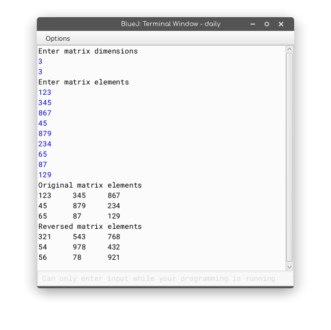

### MatRev

##### Algorithm:

* Start
* Instantiate a `MatRev` object with dimensions supplied as input
* Fill up the internal array of the object with elements supplied as input
* Display the internal array of the object in matrix representation
* Reverse each element of the object's internal array
  * Make a copy of each element and initialise a new variable to store the reversed number to 0
  * Loop while it is greater that 0, dividing it by 10 for every iteration
    * Multiply the reversed variable by 10 and add to it the remainder after dividing the copy by 10
  * Return the reversed variable
* Display the internal array of the object, this time with the reversed elements, in matrix representation
* End

##### Source Code:

```java
import java.util.Scanner;
class MatRev {
    int arr[][], m, n;
    /*
    @param_in[mm]	Row count
    @param_in[nn]	Column count
    @param_out[arr]	Current object
    */
    MatRev(int mm, int nn) {
        /* Dynamically initialise m and n for the current object */
        arr= new int[m = mm][n = nn];
    }
	/*
    @param_in[x]	Integer element
    @param_out[ret]	Reversed element
    */
    static int reverse(int x) {
        int ret = 0;
        /* Shift the digits by one place then add the last digit of the original */
        for (; x > 0; x/=10) ret = ret*10+(x%10);
        return ret;
    }

    void fillarray() {
        Scanner s = new Scanner(System.in);
        for(int mm = 0; mm < m; mm++ ) for (int nn = 0; nn < n; nn++ ) arr[mm][nn] = s.nextInt();
    }
	/*
    @param_in[P]	MatRev object
    */
    void revMat(MatRev P) {
        /* Before doing any operations,
           make sure that the arrays are homologous,
           i.e., row and column counts are equal
        */
        if (P.m == this.m && P.n == this.n) for(int mm = 0; mm < P.m; mm++ ) for (int nn = 0; nn < P.n; nn++ ) arr[mm][nn] = reverse(P.arr[mm][nn]);
        else System.out.println("Since the dimensions of the matrices aren't the same,\nthe reversed elements can't be stored in the current object.\nHalting!");        
    }

    void show() {
        for(int mm = 0; mm < m; mm++ ) {
            for (int nn = 0; nn < n; nn++ ) System.out.print(arr[mm][nn]+"\t");
            System.out.print("\n");
        }
    }

    public static void main(String args[]){
        Scanner s = new Scanner(System.in);
        System.out.println("Enter matrix dimensions");        
        MatRev obj = new MatRev(s.nextInt(),s.nextInt());
        System.out.println("Enter matrix elements");
        obj.fillarray();
        System.out.println("Original matrix elements");
        obj.show();
        obj.revMat(obj);
        System.out.println("Reversed matrix elements");
        obj.show();
    }
}
```

##### Output:

