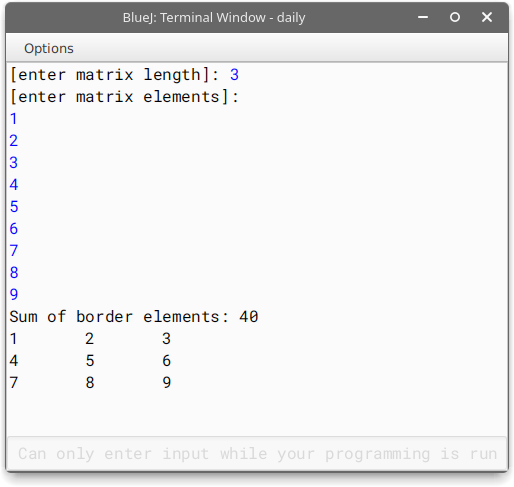

## Section B

#### Question 8

```java
import java.util.Scanner;
class Magic{
    String str;
    Magic(){
        str="";
    }
    void input(){
        Scanner s = new Scanner(System.in);
        System.out.print("Enter a word: ");
        str = s.next().toUpperCase()+" ";
        /*
        */
    }
    boolean check(){
        for(int x=0;x<str.length()-1;x++) if((str.charAt(x)-'A'+1)%26+'A'==str.charAt(x+1)) return true;
        return false;
    }
    void display(){
        System.out.println("The word is "+(check()?"":"not ")+"a Magic word.");
    }
    public static void main(String args[]){
        Magic magic = new Magic();
        magic.input();
        magic.display();
    }
}
```

##### Output:


#### Question 9

```java
import java.util.Scanner;
class MatBound{
    int mat[][], size;
    MatBound(int n){
        size = n;
        mat = new int[n][n];
    }
    void accept(){
		Scanner s = new Scanner(System.in);
		System.out.println("[enter matrix elements]:");
        for(int i=0;i<size;i++)
			for(int j=0;j<size;j++)
				mat[i][j]=s.nextInt();
    }

    void findsum(){
        int acc = 0;
		for(int i=0;i<size;i++)
			for(int j=0;j<size;j++)
				if(i==0||j==0||size-i==1||size-j==1)
                    acc += mat[i][j];
        System.out.println("Sum of border elements: "+acc);
        /* i == 0 => first element of the row
		   j == 0 => first element of the column
		   i == m - 1 => last element of the row
		   i == n - 1 => last element of the column
		*/
    }

    void display(){
        for(int i=0;i<size;i++){
			for(int j=0;j<size;j++)
                System.out.print(mat[i][j]+"\t");
            System.out.print("\n");
        }
    }

	public static void main(String args[]){
		Scanner s = new Scanner(System.in);
		System.out.print("[enter matrix length]: ");
		MatBound mat = new MatBound(s.nextInt());
        mat.accept();
        mat.findsum();
        mat.display();
	}
}
```

##### Output:



#### Question 10

```java
import java.util.Scanner;
class NumSort{
    int num;
    int arr[];
    NumSort(int n){
        num = n;
        arr = new int[(int)(Math.log10(n))+1];
    }
    void extract_digits(){
        for(int x=0;x<arr.length;x++){
            arr[x] = num % 10;
            num /= 10;
        }
    }
    void sort(){
        for(int x=0;x<arr.length-1;x++){
            for(int y=0;y<arr.length-x-1;y++){
                if(arr[y]<arr[y+1]){
                    int tmp = arr[y];
                    arr[y]=arr[y+1];
                    arr[y+1]=tmp;
                }
            }
        }
    }
    void display(){
        for(int x=0;x<arr.length;x++)
            System.out.print(arr[x]);
        System.out.print("\n");
    }
    public static void main(String args[]){
		Scanner s = new Scanner(System.in);
        System.out.print("[enter a number]: ");
        NumSort n = new NumSort(s.nextInt());
        n.extract_digits();
        n.sort();
        n.display();
    }
}
```

##### Output:

