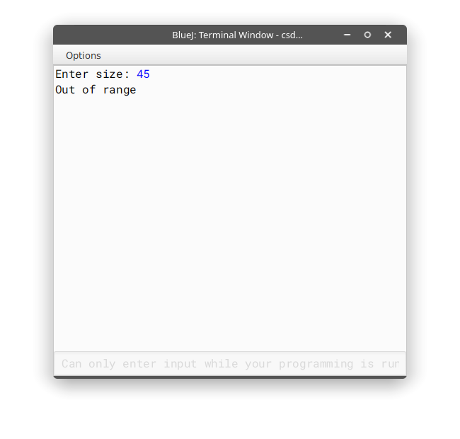
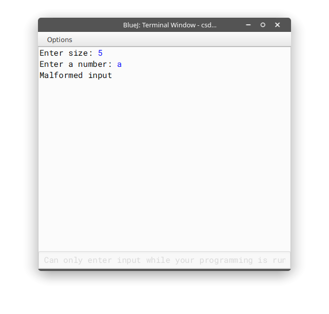
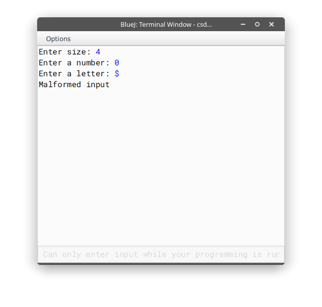
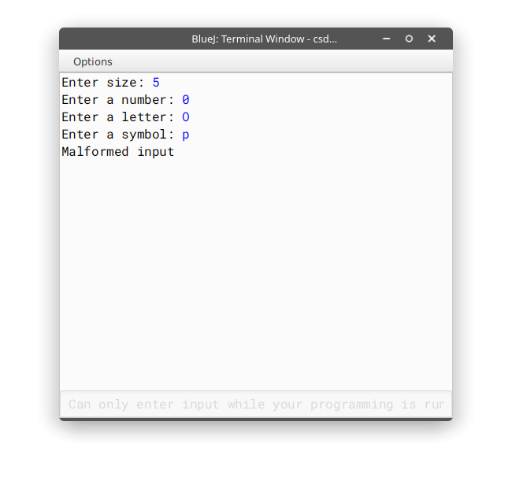
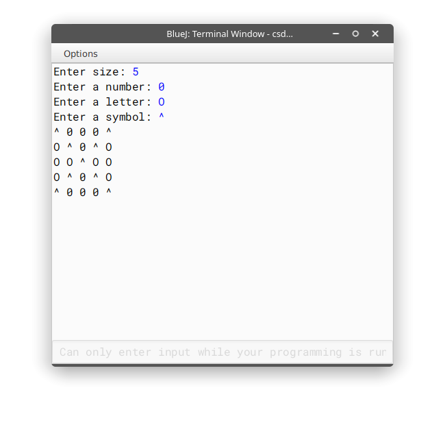
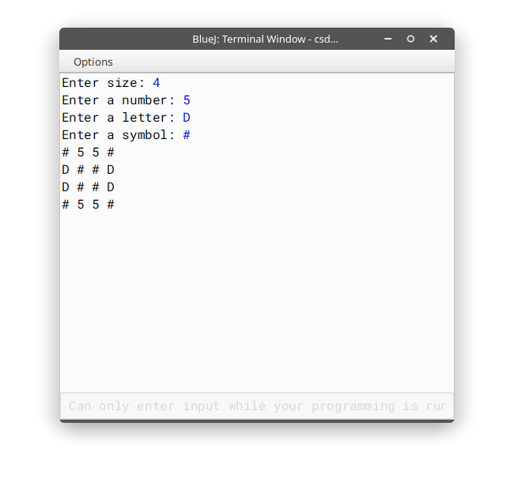

### Name: Himadri Bhattacharjee

### Class: XI, Section: A

### Roll number: 20

### Subject: Computer Science Practical Examination

---

#### Q3. To print a square matrix of user defined dimensions where the diagonals are filled with a symbol, top and bottom triangles (between diagonals) are filled with a digit and the rest with a letter, all from user input.

##### Algorithm

* Take matrix size as input (`n`)
* Check if it is greater than `0` and less than `11`
* Take input for character, number and symbol
* Check their validity respectively
* Loop from `0` to `n-1` with counter as `i`
  * Loop from `0` to `n-1` with counter as `j`
    * If the indices are equal or they add up to `n-1`, print the symbol
    * If one index is greater than the other and their sum exceeds or goes below `n-1` respectively, print the letter
    * If the previous conditions are not met, print out the digit

##### Source code

```java
import java.util.Scanner;
public class unique {
    public static void main() {
        Scanner s = new Scanner(System.in);
        char a,b,c;
        System.out.print("Enter size: ");
        int n = s.nextInt(); // matrix size
        if(n<1||n>10){ // checking range
            System.out.println("Out of range");
            System.exit(0);
        }
        System.out.print("Enter a number: ");
        a = s.next().charAt(0);
        if(!Character.isDigit(a)){ // check digit validity
            System.out.println("Malformed input");
            System.exit(0);
        }
        System.out.print("Enter a letter: ");
        b = s.next().charAt(0);
        if(!Character.isLetter(b)){ // check letter validity 
            System.out.println("Malformed input");
            System.exit(0);
        }
        System.out.print("Enter a symbol: ");
        c = s.next().charAt(0);
        if(Character.isDigit(c)||Character.isLetter(c)||c==32){
            System.out.println("Malformed input");
            System.exit(0);
        }
        /* If it is a digit, letter or whitespace, it is not a symbol */
        for(int i=0;i<n;i++){
            for(int j=0;j<n;j++){
                //checking symbol's criteria first
                if(i==j||n-i-j==1)
                    System.out.print(c+" "); // print symbol
                else if(((i+j<n-1)&&j<i)||(i<j&&(i+j>n-1)))
                    System.out.print(b+" "); // print letter
                else
                    System.out.print(a+" "); //print digit
            }
            System.out.print("\n"); // Print out in matrix form
        }
    }
}
```

##### Variable description table

| Name    | Type   | Description                 |
| ------- | ------ | --------------------------- |
| `i`,`j` | `int`  | Local iterators for looping |
| `n`     | `int`  | Holds matrix size           |
| `a`     | `char` | Character holding digit     |
| `b`     | `char` | Character holding letter    |
| `c`     | `char` | Character holding symbol    |


##### Output














